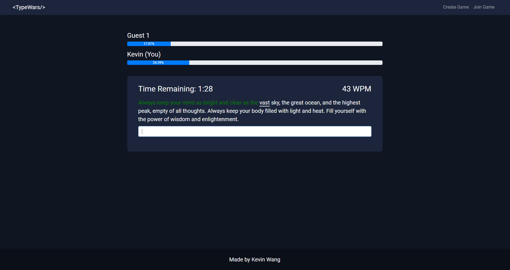
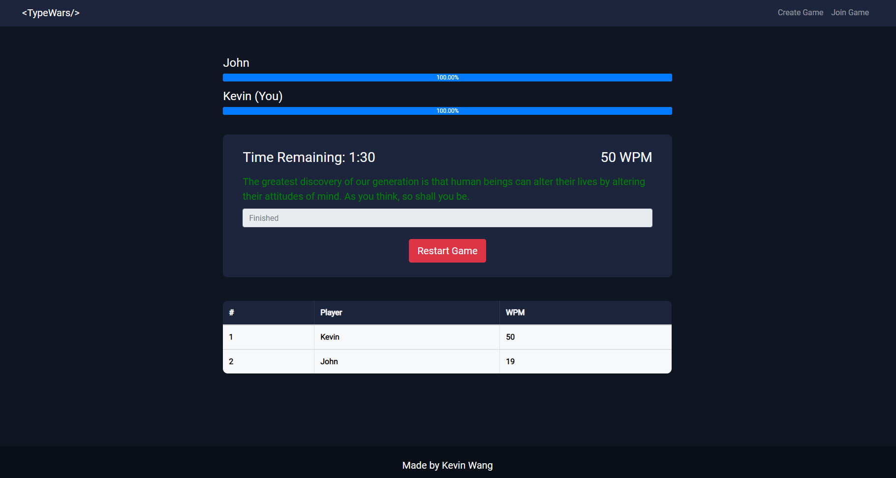

<h1>Typewars</h1>
<p>Typewars is an online competitive typing game where players can race against each other in real-time.</p>

<b>Website: </b> <a href="https://typewars.up.railway.app" target="_blank">https://typewars.up.railway.app/</a>

<b>Game page</b>

</br>
<b>Finished race</b>


<h2>Installation</h2>

Setup the project and install the packages by running:

```bash
npm run setup
```

Run project with command:

```bash
npm run dev
```

<h2>Built with</h2>
<ul>
    <li><b>FrontEnd:</b> React.JS, Bootstrap, HTML/CSS, Socket.IO </li>
    <li><b>Backend:</b> Node.JS, Express.JS, Socket.IO </li>
    <li><b>Database:</b> MongoDB, Mongoose </li>
</ul>

<h2> Features </h2>
<ul>
    <li>Create/Join/Restart games.</li>
    <li>Race against other players in real-time.</li>
    <li>Progress bars that show the progress of every participant in a race.</li>
    <li>Scoreboards that display the rankings and stats of each participant after finishing a race.</li>
</ul>

<h2>Credits</h2>
<div>Icons made by <a href="https://www.flaticon.com/authors/flat-icons" title="Flat Icons">Flat Icons</a> from <a href="https://www.flaticon.com/" title="Flaticon">www.flaticon.com</a></div>
